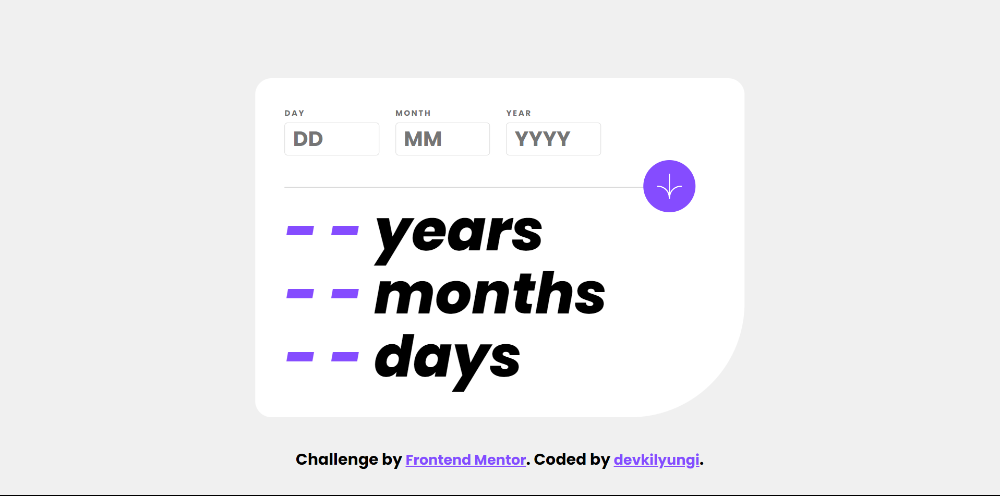
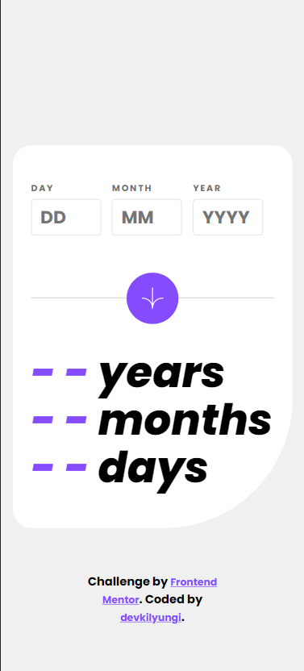

# Frontend Mentor - Age calculator app solution

This is a solution to the [Age calculator app challenge on Frontend Mentor](https://www.frontendmentor.io/challenges/age-calculator-app-dF9DFFpj-Q). Frontend Mentor challenges help you improve your coding skills by building realistic projects.

## Table of contents

- [Overview](#overview)
  - [The challenge](#the-challenge)
  - [Screenshots](#screenshots)
  - [Links](#links)
- [My process](#my-process)
  - [Built with](#built-with)
  - [What I learned](#what-i-learned)
- [Acknowledgments](#acknowledgments)

## Overview

### The challenge

My challenge was to build out this age calculator app and get it looking as close to the design as possible.

Users should be able to:
- View an age in years, months, and days after submitting a valid date through the form
- Receive validation errors if:
  - Any field is empty when the form is submitted
  - The day number is not between 1-31
  - The month number is not between 1-12
  - The year is in the future
  - The date is invalid e.g. 31/04/1991 (there are 30 days in April)
- View the optimal layout for the interface depending on their device's screen size
- See hover and focus states for all interactive elements on the page
- See the age numbers animate to their final number when the form is submitted

### Screenshots

### Links

- Solution URL: [Github Solution Link](https://github.com/devkilyungi/simple-age-calculator)
- Live Site URL: [Vercel Page](https://simple-age-calculator.vercel.app/)

## My process

### Built with

- Semantic HTML5 markup
- Flexbox
- CSS Grid
- SCSS
- JavaScript Vanilla

### What I learned

- How to validate HTML forms
- How to animate numbers using setInterval

## Acknowledgments

- Thank you to FrontEnd Mentor for providing me with the assets and the challenge. I have enjoyed building this project.
